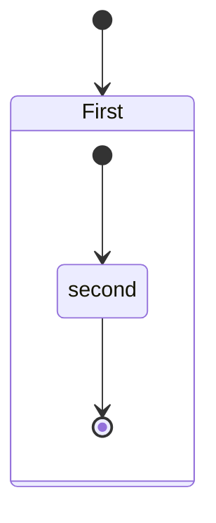

# MarkPrint

This extension converts Markdown files to pdf, html, png or jpeg files.

[Japanese README](README.ja.md)

## Table of Contents
<!-- TOC depthFrom:2 depthTo:2 updateOnSave:false -->

- [Specification Changes](#specification-changes)
- [Features](#features)
- [Install](#install)
- [Usage](#usage)
- [Pipeline Profiles & Layouts](#pipeline-profiles--layouts)
- [Extension Settings](#extension-settings)
- [Options](#options)
- [Testing](#testing)
- [Migration Guide](#migration-guide)
- [FAQ](#faq)
- [Known Issues](#known-issues)
- [Release Notes](#release-notes)
- [License](#license)
- [Special thanks](#special-thanks)

<!-- /TOC -->

<div class="page"/>

## Specification Changes

- Default Date Format for PDF Headers and Footers Modified
  - Starting from version 1.5.0, the default date format for headers and footers has been changed to the ISO-based format (YYYY-MM-DD).
  - This change aims to improve the consistency of date displays, as the previous format could vary depending on the environment.
  - If you wish to use the previous format, please refer to [markprint.headerTemplate](#markprintheadertemplate).

## Features

Supports the following features
* [Syntax highlighting](https://highlightjs.org/static/demo/)
* [emoji](https://www.webfx.com/tools/emoji-cheat-sheet/)
* [markdown-it-checkbox](https://github.com/mcecot/markdown-it-checkbox)
* [markdown-it-container](https://github.com/markdown-it/markdown-it-container)
* [markdown-it-include](https://github.com/camelaissani/markdown-it-include)
* [PlantUML](https://plantuml.com/)
  * [markdown-it-plantuml](https://github.com/gmunguia/markdown-it-plantuml)
* [mermaid](https://mermaid-js.github.io/mermaid/)

Sample files
 * [pdf](sample/README.pdf)
 * [html](sample/README.html)
 * [png](sample/README.png)
 * [jpeg](sample/README.jpeg)

### markdown-it-container

INPUT
```
::: warning
*here be dragons*
:::
```

OUTPUT
``` html
<div class="warning">
<p><em>here be dragons</em></p>
</div>
```

### markdown-it-plantuml

INPUT
```
@startuml
Bob -[#red]> Alice : hello
Alice -[#0000FF]->Bob : ok
@enduml
```

OUTPUT


### markdown-it-include

Include markdown fragment files: `:[alternate-text](relative-path-to-file.md)`.

```
├── [plugins]
│  └── README.md
├── CHANGELOG.md
└── README.md
```

INPUT
```
README Content

:[Plugins](./plugins/README.md)

:[Changelog](CHANGELOG.md)
```

OUTPUT
```
Content of README.md

Content of plugins/README.md

Content of CHANGELOG.md
```

### mermaid

INPUT
<pre>

</pre>

OUTPUT


## Install

Chromium download starts automatically when MarkPrint is installed and Markdown file is first opened with Visual Studio Code.

However, it is time-consuming depending on the environment because of its large size (~ 170Mb Mac, ~ 282Mb Linux, ~ 280Mb Win).

During downloading, the message `Installing Chromium` is displayed in the status bar.

If you are behind a proxy, set the `http.proxy` option to settings.json and restart Visual Studio Code.

If the download is not successful or you want to avoid downloading every time you upgrade MarkPrint, please specify the installed [Chrome](https://www.google.co.jp/chrome/) or 'Chromium' with [markprint.executablePath](#markprintexecutablepath) option.

<div class="page"/>

## Usage

### Command Palette

1. Open the Markdown file
1. Press `F1` or `Ctrl+Shift+P`
1. Type `export` and select below
   * `markprint: Export (settings.json)`
   * `markprint: Export (pdf)`
   * `markprint: Export (html)`
   * `markprint: Export (png)`
   * `markprint: Export (jpeg)`
   * `markprint: Export (all: pdf, html, png, jpeg)`


### Menu

1. Open the Markdown file
1. Right click and select below
   * `markprint: Export (settings.json)`
   * `markprint: Export (pdf)`
   * `markprint: Export (html)`
   * `markprint: Export (png)`
   * `markprint: Export (jpeg)`
   * `markprint: Export (all: pdf, html, png, jpeg)`


### Auto convert

1. Add `"markprint.convertOnSave": true` option to **settings.json**
1. Restart Visual Studio Code
1. Open the Markdown file
1. Auto convert on save

## Pipeline Profiles & Layouts

MarkPrint ships with bundled **pipeline profiles** (`templates/*.json`) that describe profile metadata, renderer preferences, and layout descriptors. Each profile now points to a layout artifact stored under `templates/layouts/`, with **XML/DocBook layouts serving as the canonical authoring format**. JSON, CSS, Scribus `.sla`, or Pandoc-derived assets remain supported for legacy data but are converted into XML before rendering. The extension loads these artifacts at runtime so SLA/XML conversions happen inside the export pipeline—no manual pre-processing.

### Front matter keys

- `pipeline_profile` (canonical) selects the profile. Example:

  ```yaml
  ---
  title: Example SOP
  pipeline_profile: dts-master-report
  layout_template: dts-master-report # optional legacy alias
  document_id: SOP-200
  revision: 1.0
  ---
  ```

- `layout_template` remains as a backward-compatible alias. When we insert metadata for you, both keys are written so older docs keep working.

### Layout descriptors & renderer hints

- JSON/CSS layouts: the loader simply reads the referenced `.layout.json`/`.css` file.
- Scribus `.sla`: we parse frame geometry directly and expose a neutral frame model while logging that the profile prefers a Scribus renderer.
- DocBook/Pandoc: descriptor metadata (stylesheet, filters, namespaces) is cached so we can attach proper converters in future phases.

Each layout descriptor can set `rendererHint`. Chromium remains the only active renderer today, but if a profile requests another engine we log the hint so Phase 2 can route work to Scribus/WeasyPrint/Playwright later.

### Defaults & fallbacks

- `markprint.defaultTemplate` now refers to the default pipeline profile ID.
- If neither `pipeline_profile` nor `layout_template` is provided, MarkPrint prompts (per `markprint.templateFallbackMode`) before falling back to the configured default profile.

## Extension Settings

[Visual Studio Code User and Workspace Settings](https://code.visualstudio.com/docs/customization/userandworkspace)

1. Select **File > Preferences > UserSettings or Workspace Settings**
1. Find markprint settings in the **Default Settings**
1. Copy `markprint.*` settings
1. Paste to the **settings.json**, and change the value


## Options

### List

|Category|Option name|[Configuration scope](https://code.visualstudio.com/api/references/contribution-points#Configuration-property-schema)|
|:---|:---|:---|
|[Save options](#save-options)|[markprint.type](#markprinttype)| |
||[markprint.convertOnSave](#markprintconvertonsave)| |
||[markprint.convertOnSaveExclude](#markprintconvertonsaveexclude)| |
||[markprint.outputDirectory](#markprintoutputdirectory)| |
||[markprint.outputDirectoryRelativePathFile](#markprintoutputdirectoryrelativepathfile)| |
|[Styles options](#styles-options)|[markprint.styles](#markprintstyles)| |
||[markprint.stylesRelativePathFile](#markprintstylesrelativepathfile)| |
||[markprint.includeDefaultStyles](#markprintincludedefaultstyles)| |
|[Syntax highlight options](#syntax-highlight-options)|[markprint.highlight](#markprinthighlight)| |
||[markprint.highlightStyle](#markprinthighlightstyle)| |
|[Markdown options](#markdown-options)|[markprint.breaks](#markprintbreaks)| |
|[Emoji options](#emoji-options)|[markprint.emoji](#markprintemoji)| |
|[Configuration options](#configuration-options)|[markprint.executablePath](#markprintexecutablepath)| |
|[Common Options](#common-options)|[markprint.scale](#markprintscale)| |
|[PDF options](#pdf-options)|[markprint.displayHeaderFooter](#markprintdisplayheaderfooter)|resource|
||[markprint.headerTemplate](#markprintheadertemplate)|resource|
||[markprint.footerTemplate](#markprintfootertemplate)|resource|
||[markprint.printBackground](#markprintprintbackground)|resource|
||[markprint.orientation](#markprintorientation)|resource|
||[markprint.pageRanges](#markprintpageranges)|resource|
||[markprint.format](#markprintformat)|resource|
||[markprint.width](#markprintwidth)|resource|
||[markprint.height](#markprintheight)|resource|
||[markprint.margin.top](#markprintmargintop)|resource|
||[markprint.margin.bottom](#markprintmarginbottom)|resource|
||[markprint.margin.right](#markprintmarginright)|resource|
||[markprint.margin.left](#markprintmarginleft)|resource|
|[PNG JPEG options](#png-jpeg-options)|[markprint.quality](#markprintquality)| |
||[markprint.clip.x](#markprintclipx)| |
||[markprint.clip.y](#markprintclipy)| |
||[markprint.clip.width](#markprintclipwidth)| |
||[markprint.clip.height](#markprintclipheight)| |
||[markprint.omitBackground](#markprintomitbackground)| |
|[PlantUML options](#plantuml-options)|[markprint.plantumlOpenMarker](#markprintplantumlopenmarker)| |
||[markprint.plantumlCloseMarker](#markprintplantumlclosemarker)| |
||[markprint.plantumlServer](#markprintplantumlserver)| |
|[markdown-it-include options](#markdown-it-include-options)|[markprint.markdown-it-include.enable](#markprintmarkdown-it-includeenable)| |
|[mermaid options](#mermaid-options)|[markprint.mermaidServer](#markprintmermaidserver)| |

### Save options

#### `markprint.type`
  - Output format: pdf, html, png, jpeg
  - Multiple output formats support
  - Default: pdf

```javascript
"markprint.type": [
  "pdf",
  "html",
  "png",
  "jpeg"
],
```

#### `markprint.convertOnSave`
  - Enable Auto convert on save
  - boolean. Default: false
  - To apply the settings, you need to restart Visual Studio Code
  - **Deprecated**: Switch to `markprint.buildMode = "auto"` (same behavior) or `"hybrid"`; keeping this flag set now surfaces a warning.

#### `markprint.convertOnSaveExclude`
  - Excluded file name of convertOnSave option

```javascript
"markprint.convertOnSaveExclude": [
  "^work",
  "work.md$",
  "work|test",
  "[0-9][0-9][0-9][0-9]-work",
  "work\\test"  // All '\' need to be written as '\\' (Windows)
],
```

#### `markprint.outputDirectory`
  - Output Directory
  - All `\` need to be written as `\\` (Windows)

```javascript
"markprint.outputDirectory": "C:\\work\\output",
```

  - Relative path
    - If you open the `Markdown file`, it will be interpreted as a relative path from the file
    - If you open a `folder`, it will be interpreted as a relative path from the root folder
    - If you open the `workspace`, it will be interpreted as a relative path from the each root folder
      - See [Multi-root Workspaces](https://code.visualstudio.com/docs/editor/multi-root-workspaces)

```javascript
"markprint.outputDirectory": "output",
```

  - Leaving the option empty writes exports next to the Markdown file so you do not need a staging folder for local runs.
  - Relative path (home directory)
    - If path starts with  `~`, it will be interpreted as a relative path from the home directory

```javascript
"markprint.outputDirectory": "~/output",
```

  - If you set a directory with a `relative path`, it will be created if the directory does not exist
  - If you set a directory with an `absolute path`, an error occurs if the directory does not exist

#### `markprint.outputDirectoryRelativePathFile`
  - If `markprint.outputDirectoryRelativePathFile` option is set to `true`, the relative path set with [markprint.outputDirectory](#markprintoutputDirectory) is interpreted as relative from the file
  - It can be used to avoid relative paths from folders and workspaces
  - boolean. Default: false

### Styles options

#### `markprint.styles`
  - A list of local paths to the stylesheets to use from the markprint
  - Leaving the array empty falls back to the bundled CSS under `${extensionPath}/styles`.
  - If the file does not exist, it will be skipped
  - All `\` need to be written as `\\` (Windows)
  - Resolver order: Markdown document folder -> workspace folder -> extension install. Missing files throw `Stylesheet not found...` so you can see each attempted path.

```javascript
"markprint.styles": [
  "C:\\Users\\<USERNAME>\\Documents\\markprint.css",
  "/home/<USERNAME>/settings/markprint.css",
],
```

  - Relative path
    - If you open the `Markdown file`, it will be interpreted as a relative path from the file
    - If you open a `folder`, it will be interpreted as a relative path from the root folder
    - If you open the `workspace`, it will be interpreted as a relative path from the each root folder
      - See [Multi-root Workspaces](https://code.visualstudio.com/docs/editor/multi-root-workspaces)

```javascript
"markprint.styles": [
  "markprint.css",
],
```

  - Relative path (home directory)
    - If path starts with `~`, it will be interpreted as a relative path from the home directory

```javascript
"markprint.styles": [
  "~/.config/Code/User/markprint.css"
],
```

  - Online CSS (https://xxx/xxx.css) is applied correctly for JPG and PNG, but problems occur with PDF [#67](https://github.com/gh4-io/MarkPrint/issues/67)

```javascript
"markprint.styles": [
  "https://xxx/markprint.css"
],
```

#### `markprint.stylesRelativePathFile`

  - If `markprint.stylesRelativePathFile` option is set to `true`, the relative path set with [markprint.styles](#markprintstyles) is interpreted as relative from the file
  - It can be used to avoid relative paths from folders and workspaces
  - boolean. Default: false

#### `markprint.includeDefaultStyles`
  - Enable the inclusion of default Markdown styles (VSCode, markprint)
  - boolean. Default: true

### Syntax highlight options

#### `markprint.highlight`
  - Enable Syntax highlighting
  - boolean. Default: true

#### `markprint.highlightStyle`
  - Set the style file name. for example: github.css, monokai.css ...
  - [file name list](https://github.com/isagalaev/highlight.js/tree/master/src/styles)
  - demo site : https://highlightjs.org/static/demo/

```javascript
"markprint.highlightStyle": "github.css",
```

### Markdown options

#### `markprint.breaks`
  - Enable line breaks
  - boolean. Default: false

### Emoji options

#### `markprint.emoji`
  - Enable emoji. [EMOJI CHEAT SHEET](https://www.webpagefx.com/tools/emoji-cheat-sheet/)
  - boolean. Default: true

### Configuration options

#### `markprint.executablePath`
  - Path to a Chromium or Chrome executable to run instead of the bundled Chromium
  - All `\` need to be written as `\\` (Windows)
  - To apply the settings, you need to restart Visual Studio Code

```javascript
"markprint.executablePath": "C:\\Program Files (x86)\\Google\\Chrome\\Application\\chrome.exe"
```

### Common Options

#### `markprint.scale`
  - Scale of the page rendering
  - number. default: 1

```javascript
"markprint.scale": 1
```

### PDF options

  - pdf only. [puppeteer page.pdf options](https://github.com/puppeteer/puppeteer/blob/main/docs/api/puppeteer.pdfoptions.md)

#### `markprint.displayHeaderFooter`
  - Enables header and footer display
  - boolean. Default: true
  - Activating this option will display both the header and footer
  - If you wish to display only one of them, remove the value for the other
  - To hide the header
    ```javascript
    "markprint.headerTemplate": "",
    ```
  - To hide the footer
    ```javascript
    "markprint.footerTemplate": "",
    ```

#### `markprint.headerTemplate`
  - Specifies the HTML template for outputting the header
  - To use this option, you must set `markprint.displayHeaderFooter` to `true`
  - `<span class='date'></span>` : formatted print date. The format depends on the environment
  - `<span class='title'></span>` : markdown file name
  - `<span class='url'></span>` : markdown full path name
  - `<span class='pageNumber'></span>` : current page number
  - `<span class='totalPages'></span>` : total pages in the document
  - `%%ISO-DATETIME%%` : current date and time in ISO-based format (`YYYY-MM-DD hh:mm:ss`)
  - `%%ISO-DATE%%` : current date in ISO-based format (`YYYY-MM-DD`)
  - `%%ISO-TIME%%` : current time in ISO-based format (`hh:mm:ss`)
  - Default (version 1.5.0 and later): Displays the Markdown file name and the date using `%%ISO-DATE%%`
    ```javascript
    "markprint.headerTemplate": "<div style=\"font-size: 9px; margin-left: 1cm;\"> <span class='title'></span></div> <div style=\"font-size: 9px; margin-left: auto; margin-right: 1cm; \">%%ISO-DATE%%</div>",
    ```
  - Default (version 1.4.4 and earlier): Displays the Markdown file name and the date using `<span class='date'></span>`
    ```javascript
    "markprint.headerTemplate": "<div style=\"font-size: 9px; margin-left: 1cm;\"> <span class='title'></span></div> <div style=\"font-size: 9px; margin-left: auto; margin-right: 1cm; \"> <span class='date'></span></div>",
    ```

#### `markprint.footerTemplate`
  - Specifies the HTML template for outputting the footer
  - For more details, refer to [markprint.headerTemplate](#markprintheadertemplate)
  - Default: Displays the {current page number} / {total pages in the document}
    ```javascript
    "markprint.footerTemplate": "<div style=\"font-size: 9px; margin: 0 auto;\"> <span class='pageNumber'></span> / <span class='totalPages'></span></div>",
    ```

#### `markprint.printBackground`
  - Print background graphics
  - boolean. Default: true

#### `markprint.orientation`
  - Paper orientation
  - portrait or landscape
  - Default: portrait

#### `markprint.pageRanges`
  - Paper ranges to print, e.g., '1-5, 8, 11-13'
  - Default: all pages

```javascript
"markprint.pageRanges": "1,4-",
```

#### `markprint.format`
  - Paper format
  - Letter, Legal, Tabloid, Ledger, A0, A1, A2, A3, A4, A5, A6
  - Default: A4

```javascript
"markprint.format": "A4",
```

#### `markprint.width`
#### `markprint.height`
  - Paper width / height, accepts values labeled with units(mm, cm, in, px)
  - If it is set, it overrides the markprint.format option

```javascript
"markprint.width": "10cm",
"markprint.height": "20cm",
```

#### `markprint.margin.top`
#### `markprint.margin.bottom`
#### `markprint.margin.right`
#### `markprint.margin.left`
  - Paper margins.units(mm, cm, in, px)

```javascript
"markprint.margin.top": "1.5cm",
"markprint.margin.bottom": "1cm",
"markprint.margin.right": "1cm",
"markprint.margin.left": "1cm",
```

### PNG, JPEG options

  - png and jpeg only. [puppeteer page.screenshot options](https://github.com/GoogleChrome/puppeteer/blob/master/docs/api.md#pagescreenshotoptions)

#### `markprint.quality`
  - jpeg only. The quality of the image, between 0-100. Not applicable to png images

```javascript
"markprint.quality": 100,
```

#### `markprint.clip.x`
#### `markprint.clip.y`
#### `markprint.clip.width`
#### `markprint.clip.height`
  - An object which specifies clipping region of the page
  - number

```javascript
//  x-coordinate of top-left corner of clip area
"markprint.clip.x": 0,

// y-coordinate of top-left corner of clip area
"markprint.clip.y": 0,

// width of clipping area
"markprint.clip.width": 1000,

// height of clipping area
"markprint.clip.height": 1000,
```

#### `markprint.omitBackground`
  - Hides default white background and allows capturing screenshots with transparency
  - boolean. Default: false

### PlantUML options

#### `markprint.plantumlOpenMarker`
  - Oppening delimiter used for the plantuml parser.
  - Default: @startuml

#### `markprint.plantumlCloseMarker`
  - Closing delimiter used for the plantuml parser.
  - Default: @enduml

#### `markprint.plantumlServer`
  - Plantuml server. e.g. http://localhost:8080
  - Default: http://www.plantuml.com/plantuml
  - For example, to run Plantuml Server locally [#139](https://github.com/gh4-io/MarkPrint/issues/139) :
    ```
    docker run -d -p 8080:8080 plantuml/plantuml-server:jetty
    ```
    [plantuml/plantuml-server - Docker Hub](https://hub.docker.com/r/plantuml/plantuml-server/)

### markdown-it-include options

#### `markprint.markdown-it-include.enable`
  - Enable markdown-it-include.
  - boolean. Default: true

### mermaid options

#### `markprint.mermaidServer`
  - mermaid server
  - Default: https://unpkg.com/mermaid/dist/mermaid.min.js

## Testing

Run the bundled suite with `npm test`. If VS Code's integration-test binary is missing, run `npm run test:download-vscode` first (this wraps `npx @vscode/test-electron --version 1.106.3 --download`). The `pretest` hook seeds `test/.test-workspace` with the latest templates, schemas, and SOP fixtures so layout conversions happen inside the sandbox. The suite now ensures:

- `pipeline_profile` is honored before `layout_template`, with `markprint.defaultTemplate` used as a fallback.
- Layout descriptors for JSON and Scribus `.sla` artifacts resolve through the new loader.
- Renderer hints are logged so non-Chromium requests are visible for future multi-engine work.

See [TEST.md](TEST.md) for platform notes (VS Code download cache, headless Linux tips with `xvfb-run`, etc.).

## Migration Guide

Moving from Phase 1 templates to pipeline profiles requires two steps:

1. Add `pipeline_profile` to your front matter (keep `layout_template` only for legacy docs).
2. Update custom templates to the new manifest schema (`profile`, `layout`, `resources`, `artifactMappings`). Use the bundled Standard Letter/DTS manifests as references.

The detailed checklist lives in [MIGRATION.md](MIGRATION.md), including troubleshooting tips for schema validation and renderer hints.

<div class="page"/>

## FAQ

### How can I change emoji size ?

1. Add the following to your stylesheet which was specified in the markprint.styles

```css
.emoji {
  height: 2em;
}
```

### Auto guess encoding of files

Using `files.autoGuessEncoding` option of the Visual Studio Code is useful because it automatically guesses the character code. See [files.autoGuessEncoding](https://code.visualstudio.com/updates/v1_11#_auto-guess-encoding-of-files)

```javascript
"files.autoGuessEncoding": true,
```

### Output directory

If you always want to output to the relative path directory from the Markdown file.

For example, to output to the "output" directory in the same directory as the Markdown file, set it as follows.

```javascript
"markprint.outputDirectory" : "output",
"markprint.outputDirectoryRelativePathFile": true,
```

### Page Break

Please use the following to insert a page break.

``` html
<div class="page"/>
```

<div class="page"/>

## Known Issues

### `markprint.styles` option
* Online CSS (https://xxx/xxx.css) is applied correctly for JPG and PNG, but problems occur with PDF. [#67](https://github.com/gh4-io/MarkPrint/issues/67)


## [Release Notes](CHANGELOG.md)

### 1.5.0 (2023/09/08)
* Improve: The default date format for headers and footers has been changed to the ISO-based format (YYYY-MM-DD).
  * Support different date formats in templates [#197](https://github.com/gh4-io/MarkPrint/pull/197)
* Improve: Avoid TimeoutError: Navigation timeout of 30000 ms exceeded and TimeoutError: waiting for Page.printToPDF failed: timeout 30000ms exceeded [#266](https://github.com/gh4-io/MarkPrint/pull/266)
* Fix: Fix description of outputDirectoryRelativePathFile [#238](https://github.com/gh4-io/MarkPrint/pull/238)
* README
  * Add: Specification Changes
  * Fix: Broken link

## License

MIT


## Special thanks
* [GoogleChrome/puppeteer](https://github.com/GoogleChrome/puppeteer)
* [markdown-it/markdown-it](https://github.com/markdown-it/markdown-it)
* [mcecot/markdown-it-checkbox](https://github.com/mcecot/markdown-it-checkbox)
* [leff/markdown-it-named-headers](https://github.com/leff/markdown-it-named-headers)
* [markdown-it/markdown-it-emoji](https://github.com/markdown-it/markdown-it-emoji)
* [HenrikJoreteg/emoji-images](https://github.com/HenrikJoreteg/emoji-images)
* [isagalaev/highlight.js](https://github.com/isagalaev/highlight.js)
* [cheeriojs/cheerio](https://github.com/cheeriojs/cheerio)
* [janl/mustache.js](https://github.com/janl/mustache.js)
* [markdown-it/markdown-it-container](https://github.com/markdown-it/markdown-it-container)
* [gmunguia/markdown-it-plantuml](https://github.com/gmunguia/markdown-it-plantuml)
* [camelaissani/markdown-it-include](https://github.com/camelaissani/markdown-it-include)
* [mermaid-js/mermaid](https://github.com/mermaid-js/mermaid)
* [jonschlinkert/gray-matter](https://github.com/jonschlinkert/gray-matter)

and

* [cakebake/markdown-themeable-pdf](https://github.com/cakebake/markdown-themeable-pdf)
