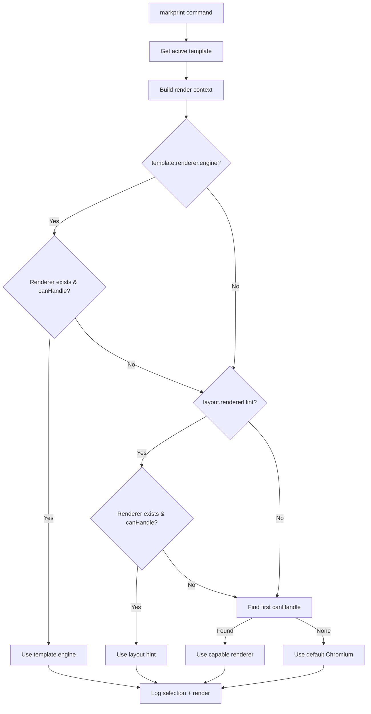

# MarkPrint Renderer Architecture

**Version**: 1.0
**Phase**: 2 (Renderer Abstraction)
**Status**: Active
**Last Updated**: 2025-12-06

---

## Table of Contents

- [Overview](#overview)
- [Architecture](#architecture)
- [IRendererDriver Interface](#irendererdriver-interface)
- [RendererRegistry](#rendererregistry)
- [Chromium Renderer](#chromium-renderer)
- [Renderer Selection](#renderer-selection)
- [Output Directory Resolution](#output-directory-resolution)
- [Template Integration](#template-integration)
- [Adding New Renderers](#adding-new-renderers)
- [Future Roadmap](#future-roadmap)
- [Debugging](#debugging)
- [Testing](#testing)
- [Troubleshooting](#troubleshooting)
- [API Reference](#api-reference)

---

## Overview

MarkPrint uses a modular renderer system to convert Markdown documents to multiple output formats (PDF, HTML, PNG, JPEG). Phase 2 introduced a clean abstraction layer that separates rendering concerns from core export logic, enabling future multi-engine support.

### Current State

- **Active Renderers**: Chromium (via Puppeteer-core v2.1.1)
- **Future Renderers**: Playwright, Vivliostyle, Paged.js, Scribus (Phase 3+)
- **Selection Method**: Template-driven with 4-tier precedence
- **Zero Breaking Changes**: Existing functionality preserved

### Design Goals

1. **Extensibility**: Support multiple rendering engines without modifying core export logic
2. **Template Control**: Let templates specify preferred renderers via `renderer.engine`
3. **Graceful Fallback**: Fall back to default renderer if preferred is unavailable
4. **Clean Separation**: Isolate Puppeteer/browser logic from extension core
5. **Testability**: Enable unit testing of renderer selection and capabilities

---

## Architecture

### Before Phase 2 (Monolithic)

```
extension.js (~1300 lines)
├── activate() - initialization
├── markprint() - export orchestration
├── renderWithChromium() - MONOLITHIC Puppeteer logic
├── convertMarkdownToHtml() - Markdown parsing
├── makeHtml() - HTML generation
└── exportPdf() - PDF/PNG/JPEG output via Puppeteer
```

**Problems**:
- Chromium/Puppeteer code deeply embedded (~500 lines in `extension.js`)
- Impossible to add alternate renderers without massive refactoring
- Template `rendererHint` logged but ignored
- Testing requires full Extension Host environment
- No clean separation of concerns

### After Phase 2 (Modular)

```
MarkPrint Extension
├── extension.js (~900 lines)
│   ├── activate() - initialization + renderer registry
│   ├── markprint() - export orchestration + renderer selection
│   ├── renderWithEngine() - dispatch to selected renderer
│   ├── resolveOutputDirectory() - hierarchical directory resolution
│   ├── convertMarkdownToHtml() - Markdown parsing (unchanged)
│   └── makeHtml() - HTML generation (unchanged)
│
├── src/renderers/
│   ├── index.js (206 lines)
│   │   ├── IRendererDriver - base interface
│   │   └── RendererRegistry - selection logic
│   └── chromiumRenderer.js (370 lines)
│       ├── renderToPdf() - PDF generation
│       ├── renderToPng() - PNG screenshots
│       ├── renderToJpeg() - JPEG screenshots
│       ├── renderToHtml() - HTML output
│       ├── buildPdfOptions() - config mapping
│       └── buildScreenshotOptions() - config mapping
│
├── test/suite/
│   └── renderer.test.js (268 lines)
│       ├── Interface compliance tests
│       ├── Registry selection tests
│       └── ChromiumRenderer capability tests
│
└── docs/
    ├── renderers.md (this file)
    └── wiki/full-docs/renderers/overview.md
```

**Benefits**:
- Clean separation: rendering isolated in `src/renderers/`
- Extensible: add new renderers without touching `extension.js`
- Testable: unit tests for renderer selection logic
- Template-driven: `renderer.engine` controls selection
- Future-ready: architecture supports Playwright, Vivliostyle, Scribus

---

## IRendererDriver Interface

All renderers must implement the `IRendererDriver` interface defined in `src/renderers/index.js`.

### Interface Definition

```javascript
/**
 * Base renderer interface that all renderers must implement
 * @interface IRendererDriver
 */
class IRendererDriver {
  /**
   * @param {Object} options - Renderer configuration options
   * @param {string} [options.extensionPath] - VS Code extension path
   */
  constructor(options = {}) {
    /** @type {string} Renderer name (e.g., 'chromium', 'playwright') */
    this.name = 'unknown';

    /** @type {string} Renderer version */
    this.version = '0.0.0';

    /** @type {string[]} Supported output formats */
    this.supportedFormats = [];
  }

  /**
   * Check if this renderer can handle the given rendering context
   * @param {Object} context - Rendering context
   * @param {string} context.format - Output format (pdf, html, png, jpeg)
   * @param {Object} [context.template] - Active template metadata
   * @param {Object} [context.layout] - Layout descriptor
   * @param {string} [context.document] - Source document path
   * @returns {boolean} True if this renderer can handle the request
   */
  canHandle(context) {
    return false;
  }

  /**
   * Render HTML content to PDF
   * @param {string} html - HTML content to render
   * @param {Object} options - Rendering options
   * @param {string} options.path - Output file path
   * @param {string} options.format - Output format ('pdf')
   * @param {Object} [options.template] - Active template metadata
   * @param {Object} [options.frontMatter] - Document front matter
   * @param {Object} [options.context] - Rendering context
   * @returns {Promise<void>}
   * @throws {Error} If not implemented
   */
  async renderToPdf(html, options) {
    throw new Error(`${this.name} renderer does not implement renderToPdf()`);
  }

  /**
   * Render HTML content to PNG image
   * @param {string} html - HTML content to render
   * @param {Object} options - Rendering options (same as renderToPdf)
   * @returns {Promise<void>}
   * @throws {Error} If not implemented
   */
  async renderToPng(html, options) {
    throw new Error(`${this.name} renderer does not implement renderToPng()`);
  }

  /**
   * Render HTML content to JPEG image
   * @param {string} html - HTML content to render
   * @param {Object} options - Rendering options (same as renderToPdf)
   * @returns {Promise<void>}
   * @throws {Error} If not implemented
   */
  async renderToJpeg(html, options) {
    throw new Error(`${this.name} renderer does not implement renderToJpeg()`);
  }

  /**
   * Render to HTML file (pass-through or enhanced)
   * Default implementation writes HTML to file
   * @param {string} html - HTML content to render
   * @param {Object} options - Rendering options
   * @param {string} options.path - Output file path
   * @returns {Promise<void>}
   */
  async renderToHtml(html, options) {
    const fs = require('fs');
    await fs.promises.writeFile(options.path, html, 'utf-8');
  }

  /**
   * Cleanup resources (close browser, temp files, etc.)
   * Called when renderer is no longer needed
   * @returns {Promise<void>}
   */
  async dispose() {
    // Override if cleanup needed
  }
}
```

### Implementation Requirements

1. **Name & Version**: Set `this.name` and `this.version` in constructor
2. **Supported Formats**: Declare `this.supportedFormats` array
3. **Capability Check**: Implement `canHandle()` to return true for supported contexts
4. **Core Methods**: Implement at least one of: `renderToPdf()`, `renderToPng()`, `renderToJpeg()`
5. **HTML Passthrough**: Optionally override `renderToHtml()` (default writes to file)
6. **Cleanup**: Implement `dispose()` if renderer needs cleanup (browser instances, temp files)

### Method Contracts

**canHandle(context)**
- MUST return boolean
- MUST check `context.format` against `this.supportedFormats`
- MAY check template/layout metadata for compatibility
- MUST NOT throw errors (return false instead)

**renderToPdf/Png/Jpeg(html, options)**
- MUST accept HTML string as first parameter
- MUST write output to `options.path`
- MUST respect `options.template` configuration if present
- MUST log start/complete with `debugLogger.log('renderer', ...)`
- SHOULD handle errors gracefully with descriptive messages
- MUST clean up resources in finally blocks

**renderToHtml(html, options)**
- SHOULD preserve HTML exactly (default implementation)
- MAY enhance HTML (e.g., inject polyfills, optimize assets)
- MUST write to `options.path`

**dispose()**
- MUST close all open browser instances
- MUST delete temporary files
- MUST NOT throw errors (log warnings instead)
- MAY be called multiple times (must be idempotent)

---

## RendererRegistry

The `RendererRegistry` class manages available renderers and selects the appropriate one for each export based on template preferences and capabilities.

### Registry API

```javascript
class RendererRegistry {
  constructor() {
    this.renderers = new Map();
    this.defaultRenderer = null;
  }

  /**
   * Register a renderer
   * @param {string} name - Renderer identifier (e.g., 'chromium')
   * @param {IRendererDriver} renderer - Renderer instance
   */
  register(name, renderer) {
    this.renderers.set(name, renderer);
    if (!this.defaultRenderer) {
      this.defaultRenderer = name;
    }
  }

  /**
   * Select renderer based on context
   * Uses 4-tier precedence: template.renderer.engine → layout.rendererHint → canHandle() → default
   * @param {Object} context - { format, template, layout, document }
   * @returns {IRendererDriver|null}
   */
  select(context) {
    const { template, layout, format } = context;

    // Priority 1: Template renderer.engine preference
    if (template?.renderer?.engine) {
      const preferred = this.renderers.get(template.renderer.engine);
      if (preferred?.canHandle(context)) {
        debugLogger.log('renderer', 'Selected via template preference', {
          name: preferred.name,
          reason: 'template.renderer.engine'
        });
        return preferred;
      }
    }

    // Priority 2: Layout rendererHint
    if (layout?.rendererHint) {
      const hinted = this.renderers.get(layout.rendererHint);
      if (hinted?.canHandle(context)) {
        debugLogger.log('renderer', 'Selected via layout hint', {
          name: hinted.name,
          reason: 'layout.rendererHint'
        });
        return hinted;
      }
    }

    // Priority 3: First renderer that canHandle()
    for (const [name, renderer] of this.renderers) {
      if (renderer.canHandle(context)) {
        debugLogger.log('renderer', 'Selected via capability', {
          name: renderer.name,
          reason: 'canHandle() match'
        });
        return renderer;
      }
    }

    // Priority 4: Default fallback
    const fallback = this.renderers.get(this.defaultRenderer);
    debugLogger.log('renderer', 'Selected default fallback', {
      name: fallback?.name || 'none',
      reason: 'default'
    });
    return fallback;
  }

  /**
   * Get renderer by name
   * @param {string} name - Renderer identifier
   * @returns {IRendererDriver|undefined}
   */
  get(name) {
    return this.renderers.get(name);
  }

  /**
   * Get all renderer names
   * @returns {string[]}
   */
  getNames() {
    return Array.from(this.renderers.keys());
  }
}
```

### Selection Algorithm

The registry uses a **4-tier precedence system** to select the best renderer:

1. **Template `renderer.engine`** (Highest Priority)
   - Template manifest explicitly requests an engine
   - Example: `{ "renderer": { "engine": "vivliostyle" } }`
   - Only used if the renderer exists and `canHandle()` returns true

2. **Layout `rendererHint`**
   - Layout descriptor suggests a renderer
   - Example: SLA layouts hint `"scribus"`, DocBook hints `"vivliostyle"`
   - Used if template doesn't specify and renderer is available

3. **Capability Matching**
   - First registered renderer where `canHandle()` returns true
   - Allows renderers to self-select based on format/context

4. **Default Fallback** (Lowest Priority)
   - Uses first registered renderer (typically Chromium)
   - Always available as safety net

### Selection Logging

Every render logs the selected renderer with justification:

```javascript
debugLogger.log('renderer', 'Selected renderer', {
  name: 'chromium',
  version: '2.1.1',
  format: 'pdf',
  template: 'dts-master-report',
  layoutHint: 'chromium',
  reason: 'template.renderer.engine'
});
```

---

## Chromium Renderer

The `ChromiumRenderer` class wraps Puppeteer-core to render HTML to PDF/PNG/JPEG using a headless Chromium browser.

### Features

- **PDF Generation**: Full page.pdf() API with custom options
- **PNG/JPEG Screenshots**: High-quality images with clip regions
- **HTML Passthrough**: Writes HTML directly to file
- **ISO Date/Time Placeholders**: `%%ISO-DATETIME%%`, `%%ISO-DATE%%`, `%%ISO-TIME%%` in headers/footers
- **Configuration**: Reads all `markprint.*` settings from VS Code config
- **Browser Lifecycle**: Launches browser, renders, cleans up in finally block
- **Error Handling**: Descriptive error messages with context

### Supported Formats

- `pdf` - Full-featured PDF with margins, headers, footers, page ranges
- `png` - High-quality PNG screenshots with transparency support
- `jpeg` - Compressed JPEG images with quality control
- `html` - HTML file output (pass-through)

### Configuration Options

All Puppeteer options are configurable via VS Code settings (`markprint.*`):

**PDF Options**:
- `markprint.format` - Page format (A4, Letter, Legal, etc.)
- `markprint.width` / `markprint.height` - Custom page dimensions
- `markprint.margin.top/bottom/left/right` - Page margins
- `markprint.displayHeaderFooter` - Enable headers/footers
- `markprint.headerTemplate` - HTML template for header
- `markprint.footerTemplate` - HTML template for footer
- `markprint.printBackground` - Print background graphics
- `markprint.orientation` - `portrait` or `landscape`
- `markprint.pageRanges` - Pages to print (e.g., `'1-5, 8, 11-13'`)
- `markprint.scale` - Page rendering scale

**Screenshot Options**:
- `markprint.quality` - JPEG quality (0-100)
- `markprint.clip.x/y/width/height` - Clip region
- `markprint.omitBackground` - Transparent background

**General**:
- `markprint.executablePath` - Path to Chrome/Chromium binary (overrides bundled)

### ISO Date/Time Placeholders

ChromiumRenderer replaces placeholders in header/footer templates:

- `%%ISO-DATETIME%%` → `2025-12-06 14:35:22`
- `%%ISO-DATE%%` → `2025-12-06`
- `%%ISO-TIME%%` → `14:35:22`

Example header template:
```javascript
"markprint.headerTemplate": "<div style=\"font-size: 9px; margin-left: 1cm;\"><span class='title'></span></div> <div style=\"font-size: 9px; margin-left: auto; margin-right: 1cm;\">%%ISO-DATE%%</div>"
```

### Browser Lifecycle

```javascript
const browser = await puppeteer.launch({
  executablePath,
  args: ['--no-sandbox', '--disable-setuid-sandbox'],
  headless: true
});

try {
  const page = await browser.newPage();
  await page.setContent(html, { waitUntil: 'networkidle0' });
  await page.pdf(pdfOptions);
} finally {
  await browser.close(); // Always cleanup
}
```

### Error Handling

ChromiumRenderer provides descriptive errors:

- **Missing Chromium**: `"Chromium executable not found. Run 'npm install' or set markprint.executablePath."`
- **Render Timeout**: `"PDF render timeout after 30s. Try reducing document size or disabling images."`
- **Invalid Config**: `"Invalid page format 'XYZ'. Use: A4, Letter, Legal, Tabloid, Ledger, A0-A6."`
- **Write Failure**: `"Failed to write PDF to /path/file.pdf: Permission denied"`

---

## Renderer Selection

### How It Works

When you trigger an export (`extension.markprint.pdf`), the registry selects a renderer:



### Example Scenarios

**Scenario 1: Template Specifies Engine**

Template manifest:
```json
{
  "renderer": {
    "engine": "chromium"
  }
}
```

Result: Uses Chromium (priority 1)

**Scenario 2: Layout Hints Renderer**

Layout descriptor:
```json
{
  "type": "sla",
  "rendererHint": "scribus"
}
```

Result: Logs warning (Scribus not available), falls back to Chromium (priority 4)

**Scenario 3: No Preferences**

Template has no `renderer.engine`, layout has no `rendererHint`

Result: First renderer that `canHandle()` (Chromium)

**Scenario 4: Fallback Chain**

Template manifest:
```json
{
  "renderer": {
    "engine": "vivliostyle",
    "fallback": ["chromium"]
  }
}
```

Result: Vivliostyle not available (Phase 3), falls back to Chromium

---

## Output Directory Resolution

MarkPrint uses a **3-tier precedence system** for output directories:

### Precedence Order

1. **Profile `outputs.*.target_directory`** (Highest)
   - Template-specific output location
   - Per-format customization (PDF vs HTML vs PNG)

2. **Setting `markprint.outputDirectory`** (Medium)
   - User workspace/global preference
   - Applies to all templates

3. **Source Directory** (Fallback)
   - Same directory as Markdown file
   - No configuration needed

### Resolution Logic

```javascript
function resolveOutputDirectory(sourcePath, template) {
  const config = vscode.workspace.getConfiguration('markprint');

  // Priority 1: Profile output directory
  if (template?.profile?.outputs) {
    const outputConfig = template.profile.outputs.pdf || template.profile.outputs.html;
    if (outputConfig?.target_directory) {
      debugLogger.log('renderer', 'Using profile output directory', {
        directory: outputConfig.target_directory,
        precedence: 'profile'
      });
      return resolveSettingPath(outputConfig.target_directory, sourcePath);
    }
  }

  // Priority 2: markprint.outputDirectory setting
  const settingDir = config['outputDirectory'];
  if (settingDir) {
    debugLogger.log('renderer', 'Using setting output directory', {
      directory: settingDir,
      precedence: 'setting'
    });
    return resolveSettingPath(settingDir, sourcePath);
  }

  // Priority 3: Source file directory
  debugLogger.log('renderer', 'Using source directory', {
    directory: path.dirname(sourcePath),
    precedence: 'default'
  });
  return path.dirname(sourcePath);
}
```

### Path Resolution

All paths support:
- **Absolute**: `/home/user/output`
- **Workspace-relative**: `output` (relative to workspace root)
- **Home-relative**: `~/output` (expands `~` to home directory)
- **Variables**: `${workspaceFolder}/dist/reports`

### Example Configurations

**Per-Template Outputs**:
```json
{
  "profile": {
    "id": "dts-master-report"
  },
  "outputs": {
    "pdf": {
      "target_directory": "${workspaceFolder}/dist/reports"
    },
    "html": {
      "target_directory": "${workspaceFolder}/dist/web"
    }
  }
}
```

**Global Setting**:
```json
{
  "markprint.outputDirectory": "~/Documents/MarkPrint-Exports"
}
```

**No Configuration** (default):
- Exports to same directory as source `.md` file

---

## Template Integration

Templates control renderer selection via pipeline profile manifests (`templates/*.json`).

### Manifest Schema

```json
{
  "profile": {
    "id": "my-template",
    "label": "My Template",
    "version": "1.0.0",
    "schema": ".markprint/schemas/my-template.schema.json"
  },
  "renderer": {
    "engine": "chromium",
    "fallback": ["chromium"]
  },
  "layout": {
    "type": "json",
    "source": "layout.json",
    "rendererHint": "chromium"
  },
  "outputs": {
    "pdf": {
      "target_directory": "${workspaceFolder}/dist/reports",
      "filename_pattern": "${document_id}_${revision}.pdf"
    },
    "html": {
      "target_directory": "${workspaceFolder}/dist/web"
    }
  }
}
```

### Renderer Configuration

**`renderer.engine`** (string, optional)
- Preferred renderer identifier
- Examples: `"chromium"`, `"playwright"`, `"vivliostyle"`
- Falls back if unavailable

**`renderer.fallback`** (array, optional)
- Ordered list of fallback renderers
- Tried in sequence if primary fails
- Example: `["vivliostyle", "chromium"]`

### Layout Hints

**`layout.rendererHint`** (string, optional)
- Suggested renderer based on layout type
- Examples:
  - SLA layouts: `"scribus"`
  - DocBook layouts: `"vivliostyle"`
  - JSON layouts: `"chromium"`

### Front Matter Integration

Documents specify templates via front matter:

```yaml
---
title: Example SOP
pipeline_profile: dts-master-report
document_id: SOP-200
revision: 1.0
---
```

The `pipeline_profile` key selects the template, which determines renderer.

---

## Adding New Renderers

### Step-by-Step Guide

**1. Create Renderer Class**

Create `src/renderers/myRenderer.js`:

```javascript
const { IRendererDriver } = require('./index');
const debugLogger = require('../debugLogger');

class MyRenderer extends IRendererDriver {
  constructor(options = {}) {
    super(options);
    this.name = 'myrenderer';
    this.version = '1.0.0';
    this.supportedFormats = ['pdf', 'html'];
  }

  canHandle(context) {
    // Check if we support this format
    return this.supportedFormats.includes(context.format);
  }

  async renderToPdf(html, options) {
    debugLogger.log('renderer', 'MyRenderer PDF start', options);

    try {
      // Your PDF rendering logic here
      // Write to options.path

      debugLogger.log('renderer', 'MyRenderer PDF complete', {
        path: options.path
      });
    } catch (error) {
      debugLogger.log('renderer', 'MyRenderer PDF failed', {
        error: error.message
      });
      throw error;
    }
  }

  async dispose() {
    // Cleanup resources
  }
}

module.exports = MyRenderer;
```

**2. Register in Extension**

Modify `extension.js` `activate()`:

```javascript
const MyRenderer = require('./src/renderers/myRenderer');

function activate(context) {
  // ... existing initialization ...

  rendererRegistry = new RendererRegistry();
  rendererRegistry.register('chromium', new ChromiumRenderer({
    extensionPath: context.extensionPath
  }));
  rendererRegistry.register('myrenderer', new MyRenderer({
    extensionPath: context.extensionPath
  }));

  debugLogger.log('renderer', 'Renderer registry initialized', {
    available: rendererRegistry.getNames(),
    default: rendererRegistry.defaultRenderer
  });
}
```

**3. Add Unit Tests**

Create `test/suite/myRenderer.test.js`:

```javascript
const assert = require('assert');
const MyRenderer = require('../../src/renderers/myRenderer');

suite('MyRenderer', function() {
  test('canHandle returns true for supported formats', function() {
    const renderer = new MyRenderer();
    assert.strictEqual(renderer.canHandle({ format: 'pdf' }), true);
    assert.strictEqual(renderer.canHandle({ format: 'xyz' }), false);
  });

  test('renderToPdf writes output file', async function() {
    const renderer = new MyRenderer();
    const testHtml = '<html><body>Test</body></html>';
    const testPath = '/tmp/test.pdf';

    await renderer.renderToPdf(testHtml, { path: testPath });

    // Assert file exists
  });
});
```

**4. Document Capabilities**

Update `docs/renderers.md` (this file) with:
- Supported formats
- Configuration options
- Limitations
- Usage examples

**5. Update Templates**

Templates can now request your renderer:

```json
{
  "renderer": {
    "engine": "myrenderer",
    "fallback": ["chromium"]
  }
}
```

---

## Future Roadmap

### Phase 3: Multi-Engine Support

**Playwright Renderer**
- Multi-browser support (Chromium, Firefox, WebKit)
- Better DevTools integration
- Cross-browser testing capability
- Implementation: 2-3 days
- Status: Planned

**Paged.js Polyfill**
- Pure JavaScript pagination enhancement
- MIT license (permissive)
- Inject into existing renderers
- Advanced layout features (floats, footnotes, running headers)
- Implementation: 1-2 days
- Status: Planned

### Phase 4: Professional Publishing

**Vivliostyle Renderer**
- Advanced CSS Paged Media support
- Print-quality output
- Book/manual production features
- **AGPL license** - requires legal review
- Implementation: 3-4 days
- Status: Under Evaluation

**Scribus Renderer**
- SLA file playback
- Desktop publishing quality
- Handoff artifact generation
- Manual Scribus invocation
- Implementation: 2-3 days stub
- Status: Phase 4+

### Phase 5: Enterprise Features

**WeasyPrint Renderer**
- Python-based HTML/CSS renderer
- High-quality PDF output
- Requires Python runtime
- Status: Deferred (breaks self-contained constraint)

**PrinceXML API**
- Commercial renderer
- Professional print quality
- Paid licensing required
- Status: Future consideration

---

## Debugging

### Enable Debug Logging

Set VS Code setting:
```json
{
  "markprint.debugMode": true
}
```

View logs in **Output** panel (select "MarkPrint" from dropdown).

### Key Log Categories

**Renderer Selection**:
```
[renderer] Renderer registry initialized
  available: ["chromium"]
  default: "chromium"

[renderer] Selected renderer
  name: "chromium"
  version: "2.1.1"
  format: "pdf"
  template: "dts-master-report"
  layoutHint: "chromium"
  reason: "template.renderer.engine"
```

**Output Directory**:
```
[renderer] Using profile output directory
  directory: "/workspace/dist/reports"
  precedence: "profile"
```

**Render Operations**:
```
[renderer] Chromium PDF render start
  path: "/workspace/dist/reports/SOP-200.pdf"
  format: "A4"

[renderer] Chromium PDF render complete
  path: "/workspace/dist/reports/SOP-200.pdf"
```

### Common Debug Scenarios

**Renderer not selected**:
1. Check template `renderer.engine` matches registered renderer name
2. Verify renderer's `canHandle()` returns true for format
3. Check registry initialization logs

**Wrong output directory**:
1. Check precedence logs (profile → setting → default)
2. Verify profile `outputs.pdf.target_directory` syntax
3. Test path resolution with different configurations

**Render fails**:
1. Check Chromium logs for browser errors
2. Verify HTML is valid (inspect with `renderToHtml` first)
3. Check file permissions for output directory
4. Look for timeout errors (increase `waitUntil` timeout)

---

## Testing

### Unit Tests

**Renderer Interface** (`test/suite/renderer.test.js`):
- IRendererDriver compliance
- RendererRegistry registration/retrieval
- Selection logic with various contexts
- ChromiumRenderer capabilities
- Template transformations (ISO placeholders)
- Path resolution (home, absolute, workspace-relative)

Run unit tests:
```bash
npm test
```

### Integration Tests

**Extension Tests** (`test/suite/extension.test.js`):
- Full export pipeline (Markdown → PDF/HTML/PNG/JPEG)
- Template loading and selection
- Schema validation
- Renderer selection
- Output file generation

Run integration tests:
```bash
npm run test:download-vscode  # First time only
npm test
```

### Manual Verification

**Test SOP-200 Export**:
1. Press `F5` to launch Extension Development Host
2. Open `test/suite/SOP-200_Create_Workpackage_Sequencing_Type.md`
3. Execute: `MarkPrint: Export (pdf)`
4. Verify: PDF created in correct directory
5. Check: Debug console shows renderer selection logs

**Test All Formats**:
1. Execute: `MarkPrint: Export (all: pdf, html, png, jpeg)`
2. Verify: All 4 files created
3. Compare: Visual quality to baseline

**Test Custom Template**:
1. Create template with `renderer.engine` and `outputs.pdf.target_directory`
2. Set `pipeline_profile` in document front matter
3. Export and verify renderer selection + output location

### WSL2 Environment

**Install Chromium Dependencies**:
```bash
sudo apt update && sudo apt install -y \
  libnss3 libnspr4 libatk1.0-0 libatk-bridge2.0-0 \
  libcups2 libdrm2 libxkbcommon0 libxcomposite1 \
  libxdamage1 libxfixes3 libxrandr2 libgbm1 libasound2
```

**Run Tests Headless**:
```bash
xvfb-run -a npm test
```

---

## Troubleshooting

### Chromium Not Found

**Error**: `"Chromium executable not found"`

**Solutions**:
1. Run `npm install` to download bundled Chromium
2. Set `markprint.executablePath` to existing Chrome:
   ```json
   {
     "markprint.executablePath": "C:\\Program Files\\Google\\Chrome\\Application\\chrome.exe"
   }
   ```
3. Check Chromium download status in Output panel

### Render Timeout

**Error**: `"Navigation timeout of 30000 ms exceeded"`

**Solutions**:
1. Reduce document size or image count
2. Use local images instead of remote URLs
3. Increase timeout in ChromiumRenderer:
   ```javascript
   await page.setContent(html, { waitUntil: 'networkidle0', timeout: 60000 });
   ```

### Wrong Output Directory

**Issue**: Files exported to unexpected location

**Debug**:
1. Check logs for output directory resolution
2. Verify precedence: profile → setting → source
3. Test path variables (`${workspaceFolder}`, `~`)
4. Check file permissions for target directory

### Renderer Not Available

**Warning**: `"Renderer 'vivliostyle' requested but not available"`

**Solutions**:
1. Check renderer is registered in `extension.js` `activate()`
2. Verify renderer module installed and required
3. Add to `renderer.fallback` for graceful degradation:
   ```json
   {
     "renderer": {
       "engine": "vivliostyle",
       "fallback": ["chromium"]
     }
   }
   ```

### HTML Not Rendering

**Issue**: PDF/PNG blank or incomplete

**Debug**:
1. Export as HTML first to inspect content
2. Check CSS syntax errors (breaks rendering)
3. Verify images load (check Network panel)
4. Test with default styles: `markprint.includeDefaultStyles: true`

### Tests Fail on WSL2

**Error**: `"error while loading shared libraries: libnspr4.so"`

**Solution**: Install missing dependencies (see WSL2 Environment section above)

---

## API Reference

### IRendererDriver

```typescript
interface IRendererDriver {
  name: string;
  version: string;
  supportedFormats: string[];

  canHandle(context: RenderContext): boolean;
  renderToPdf(html: string, options: RenderOptions): Promise<void>;
  renderToPng(html: string, options: RenderOptions): Promise<void>;
  renderToJpeg(html: string, options: RenderOptions): Promise<void>;
  renderToHtml(html: string, options: RenderOptions): Promise<void>;
  dispose(): Promise<void>;
}
```

### RendererRegistry

```typescript
class RendererRegistry {
  register(name: string, renderer: IRendererDriver): void;
  select(context: RenderContext): IRendererDriver | null;
  get(name: string): IRendererDriver | undefined;
  getNames(): string[];
}
```

### RenderContext

```typescript
interface RenderContext {
  format: 'pdf' | 'html' | 'png' | 'jpeg';
  template?: {
    renderer?: {
      engine?: string;
      fallback?: string[];
    };
    profile?: {
      outputs?: {
        [format: string]: {
          target_directory?: string;
        };
      };
    };
  };
  layout?: {
    rendererHint?: string;
  };
  document: string;
}
```

### RenderOptions

```typescript
interface RenderOptions {
  path: string;
  format: string;
  uri?: string;
  template?: object;
  frontMatter?: object;
  context?: RenderContext;
}
```

---

## Summary

Phase 2 renderer abstraction provides:

✅ Clean separation of rendering from core export logic
✅ Extensible architecture for future renderers
✅ Template-driven renderer selection
✅ Hierarchical output directory resolution
✅ Comprehensive logging and debugging
✅ Zero breaking changes to existing functionality
✅ Production-ready Chromium renderer
✅ Unit and integration test coverage

**Current**: Chromium only (Phase 2)
**Next**: Playwright, Paged.js (Phase 3)
**Future**: Vivliostyle, Scribus (Phase 4+)

For questions or issues, see [GitHub Issues](https://github.com/gh4-io/MarkPrint/issues).

---

**Document Version**: 1.0
**Last Updated**: 2025-12-06
**Author**: Codex (Claude Sonnet 4.5)
**Phase**: 2 (Renderer Abstraction)
