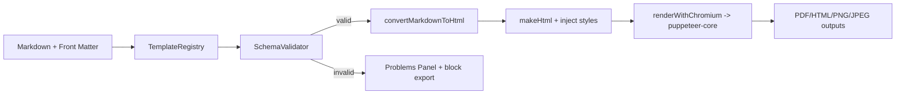

# Renderer Overview

## Requirements
- `puppeteer-core` bundled with MarkPrint (`npm install` installs dependencies).
- Chromium download (~280 MB) completes on first run or `markprint.executablePath` points to an existing Chrome.
- VS Code permissions allow spawning headless Chromium (no sandbox restrictions on local OS).

## Quick Install / Run
1. `npm install`
2. Launch VS Code and open a Markdown file.
3. Trigger any MarkPrint export; the extension will:
   - Run `init()` in `extension.js`, calling `checkPuppeteerBinary()` → `installChromium()` when missing.
   - After download, exports use `puppeteer-core`’s `browser.newPage().pdf()` / `screenshot()` flows.

## Phase 1 Flow (Chromium Only)

### Key Files
- `extension.js`: orchestrates command handlers, renderer logging, and fallback behavior.
- `src/layoutLoader.js`: surfaces `layoutRendererHint` which is logged if non-Chromium requested.
- `styles/*.css`: default CSS stack injected before rendering.

## Renderer Hints & Logging
- Manifest `profile.renderer.engine` indicates the requested engine (default `chromium`).
- Layout `rendererHint` surfaces preferred renderer for the descriptor (e.g., `"scribus"`).
- `extension.js` logs WARN level when hints differ from the active engine but proceeds with Chromium.

## Limitations
- **Single engine**: All exports still run through Chromium regardless of hints.
- **Timeouts**: Large documents can hit Puppeteer timeouts (default 30s) though Phase 1 increased allowances.
- **No offline fonts**: Fonts referenced in CSS must exist on the system; there’s no automatic font packaging yet.

## Phase 2 Outlook (Planned)
- Introduce renderer registry abstraction so `renderer.engine` can load modules (Chromium, Scribus CLI, Playwright).
- SLA + DocBook converters will feed neutral frame data to either HTML/CSS engines or native DTP exporters.
- Renderer hints will become selection inputs rather than informational logs.

## Verification
- Run `npm test` to execute VS Code integration tests (ensures template loader + schema validator pass).
- Manual check: run `MarkPrint: Export (pdf)` and confirm debug log includes `Chromium render start` and `Using pipeline profile ...`.

## Change History
- 2025-12-06: Documented current Chromium pipeline and Phase 2 plans (Codex).
